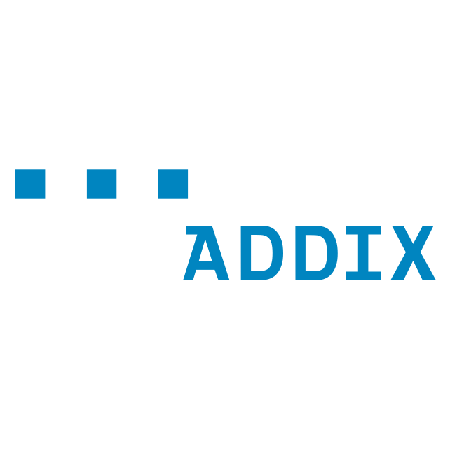

<!-- Header Area begin --->

  
  
  
  

<!-- Header Area end --->

# TouristRecommendation

A recommendation that has been generated for a given location. The recommendation, which is based on a point of interest, includes a list of recommended points of interest and a list of recommended parking lots.

|Property|Expected Type|Description|Cardinality|
|---|---|---|---|
|id|[Text](https://schema.org/Text)|**From Vocabulary**: The identifier property represents any kind of identifier for any kind of [Thing](https://schema.org/Thing), such as ISBNs, GTIN codes, UUIDs etc. Schema.org provides dedicated properties for representing many of these, either as textual strings or as URL (URI) links. See [background notes](http://schema.org/docs/datamodel.html#identifierBg) for more details.|1|
|dateCreated|[DateTime](https://schema.org/DateTime)|The date on which the Entity was created. This will usually be allocated by the storage platform.|0..1|
|dateModified|[DateTime](https://schema.org/DateTime)|The date on which the Entity was most recently modified. This will usually be allocated by the storage platform.|0..1|
|source|[URL](https://schema.org/URL)|URL of the source of this entity.|0..1|
|name|[Text](https://schema.org/Text)|The name of the entity.|0..1|
|alternateName|[Text](https://schema.org/Text)|If available, an alternative name for the entity.|0..1|
|description|[Text](https://schema.org/Text)|A description of the entity.|0..1|
|dataProvider|[Text](https://schema.org/Text)|Name of the company, person or organisation providing this entity.|0..1|
|owner|[Text](https://schema.org/Text)|Identifier of the owner of this entity.|0..N|
|seeAlso|[Text](https://schema.org/Text)|List of additional resources about the entity.|0..N|
|location|[GeoCoordinates](https://schema.org/GeoCoordinates)|The geo coordinates of this entity.|1|
|address|[PostalAddress](https://schema.org/address)|Physical address of the entity.|0..1|
|areaServed|[Text](https://schema.org/Text)|The geographic area where a service or offered item is provided.|0..1|
|refBasis|[Text](https://schema.org/Text)|Identifier this recommendation is based on.|0..1|
|refRecommendedParking|[Text](https://schema.org/Text)|Identifiers of the recommended parking spaces. Order of importance descending.|0..N|
|refRecommendenPoI|[Text](https://schema.org/Text)|Identifiers of the recommended points of interest. Order of importance descending.|0..N|
|type|[Text](https://schema.org/Text)|NGSI Entity type. It has to be TouristRecommendation|1|
|validFrom|[DateTime](https://schema.org/DateTime)|Date and time from which the entity is valid.|0..1|
|validTo|[DateTime](https://schema.org/DateTime)|Date and time until the entity is valid.|0..1|